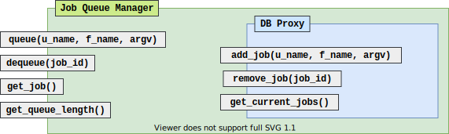

# FaaS Project - MUCPD UPV

## Description

This project's aim is to build and deploy a basic Functions-as-a-Service platform capable of handling on demand computation of arbitrary functions. It will be served as REST API ([documentation here](API_DOCS/README.md)) with simplistic user services, monitoring and auto-scaling.

## Implementation

In order to develop a distributed system capable of handling variable loads, the full FaaS is divided into 4 separate components. Communication between the different components is via [ZeroMQ](https://zeromq.org/) sockets.

### Frontend


[The frontend component](IMPLEMENTATION/frontend) is in charge of receiving users' requests and route them through the system accordingly. It's implemented as a basic [ExpressJS](https://expressjs.com/) server. On startup it receives initialization data through environment variables:

- `DB_URL` Specifies the location and protocol of the database manager (DBManager) service. 
  Must be a [valid ZeroMQ](https://zguide.zeromq.org/docs/) connection string.

- `JQ_URL` Specifies the location and protocol of the job-queue manager (JQManager) service.
  Must be a [valid ZeroMQ](https://zguide.zeromq.org/docs/) connection string.

- `PORT` Specifies the port on which the frontend will listen.

### Database Manager (DBManager)


[The DBManager component](IMPLEMENTATION/database) is in charge of offering an interface to a MongoDB database. On startup it receives initialization data through environment variables:

 - `DB_URL` Specifies the location of the (MongoDB) database service.
    Must be a valid [MongoDB](https://docs.mongodb.com/manual/reference/connection-string/) connection string.
 
 - `PORT` Specifies the port on which the database manager will listen for ZeroMQ connections.

 Along with the DBManager implementation a [DBManager proxy](IMPLEMENTATION/lib/DBManagerProxy.js) abstracts communication and gives a common inteface for all other components to use.


### Job-queue Manager (JQManager)



[The JQManager component](IMPLEMENTATION/job-queue) is in charge of managing the function calls and distributing them between the workers that will execute them. On startup it receives initialization data through environment variables:
 
 - `DB_URL` Specifies the location and protocol of the job-queue manager (DBManager) service.
    Must be a valid [ZeroMQ](https://zguide.zeromq.org/docs/) connection string.
 
 - `PORT` Specifies the port on which the job-queue manager will listen for ZeroMQ connections.

 Along with the JQManager implementation a [JQManager proxy](IMPLEMENTATION/lib/JQManagerProxy.js) abstracts communication and gives a common inteface for all other components to use.

### Worker


[The worker component](IMPLEMENTATION/worker) executing the requested function calls. Functions called are executed in a sandboxed environment although not completely safe via [NodeJS's vm](https://nodejs.org/api/vm.html). 

On startup it receives initialization data through environment variables:

- `DB_URL` Specifies the location and protocol of the database manager (DBManager) service. 
  Must be a [valid ZeroMQ](https://zguide.zeromq.org/docs/) connection string.

- `JQ_URL` Specifies the location and protocol of the job-queue manager (JQManager) service.
  Must be a [valid ZeroMQ](https://zguide.zeromq.org/docs/) connection string.

- `PORT` Specifies the port on which the frontend will listen.

## Auto-scaling


In order to auto-scale the service depending on the current workload a [scaler component](IMPLEMENTATION/scaler) is implemented. It will query the JQManager for the size of the current job backlog. If it grows too much, the number of workers will increase (up to a maximum) and if the workload diminishes the number of workers will decrease (down to a minimum).

It must be noted that the credentials of the service must be given to the scaler component on deployment. A file called `KUMORI_CREDENTIALS` must be located on the components' working directory and it must contain the username and the password, separated by a **new line**:

```
<username>
<password>
```

For example, the credentials file could be given to the component this way:
```bash
> kumorictl exec -it $DEPLOYMENT scaler $INSTANCE -- bash
> echo -e 'USERNAME\nPASSWORD' >> KUMORI_CREDENTIALS
```

## Deployment


The deployment of the service is described as a [CUE](https://cuelang.org/) module. The 7 components required are:

- [DBManager](DEPLOYMENT/faas-manifests/components/dbmanager/manifest.cue)
- [JQManager](DEPLOYMENT/faas-manifests/components/jqmanager/manifest.cue)
- [Frontend](DEPLOYMENT/faas-manifests/components/frontend/manifest.cue)
- [Worker](DEPLOYMENT/faas-manifests/components/worker/manifest.cue)
- [Scaler](DEPLOYMENT/faas-manifests/components/scaler/manifest.cue)
- [Database](DEPLOYMENT/faas-manifests/components/mongodb/manifest.cue)

Each component module it describes among other things the docker image it uses ([example](DEPLOYMENT/faas-manifests/components/frontend/manifest.cue#L45-L51)) and the environment variables it will use os startup ([example](DEPLOYMENT/faas-manifests/components/frontend/manifest.cue#L54-L58)). For more information about how the deployment is described check the platform documentation [here](https://docs.kumori.systems/service-model/1.0.0/index.html). A sample deployment script can be found [here](DEPLOYMENT/deploy_example.sh) and a script that describes how the docker images must be build [here](IMPLEMENTATION/build_images_example.sh).

## F.A.Q.

### How are functions specified?

The functions must be specified as [NodeJS](https://www.nodejs.dev) function. They can be both asynchronous or syncronous and be executable in a [sandboxed vm](https://nodejs.org/api/vm.html#vm_script_runinnewcontext_contextobject_options) environment. The precise method of function execution can be found [here](IMPLEMENTATION/worker/src/Worker.js#L52-L81). For example, the following would be valid functions:

```js
async function add(a,b) { return a + b; }
```

```js
async function add_with_delay(a,b) {
  await (new Promise((res,_) => setTimeout(res, 1000))); // Wait 1 second
  return a + b;
}
```

### How are functions registered in the system?

- Firstly, you must [register your user](API_DOCS/users/post.md).
- Then, you can [register any amount of functions](API_DOCS/functions/post.md).

### How are execution requests sent to the system?

Execution requests are sent as described in the [REST API](API_DOCS/function/execute.md).

### How are executiong results gathered?

After sending an execution request, an execution ID will be received in response. One can [poll the job status](API_DOCS/jobs/get_status.md) and once the stated changes to `1`, the [execution result can be requested](API_DOCS/jobs/get_result.md).

### How does the service auto-scaler?

Every couple of seconds, the scaler component polls the JQManager's job queue length and if it grows too much the number of workers is doubled (up to a maximum). The exact implementation can be found [here](IMPLEMENTATION/scaler/src/Scaler.js#L106-L146).

### How are execution resources measured for each user?

The workers measure each function's execution time individually and adds it to the owner's total execution time in the database.